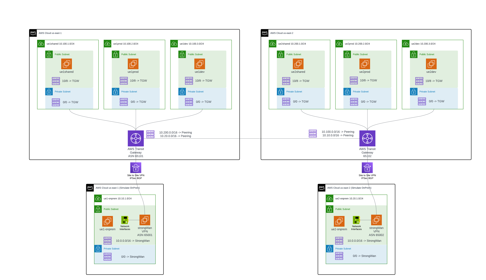

# terraform-aws-tgw-strongwan-site-to-site-vpn
This module creates AWS TGWs in two regions and simulate connection to onpremise using Quuaga StrongWAN BGP IPSec.
* In two seperate regions, create one TGW per region. 
* In each region, create multiple VPCs and attach to TGW.
* in each region, create one VPC simulate onpremise environment. Deploy Quuaga StrongWAN VM and establish BGP IPSec connections to TGW.
* TGW exchange routes with Quuaga StrongWAN via BGP.
* Static Route table in TGW is needed to route traffic bewteen two regions, as TGW doesn't propagate routes in between.
* Static Route added to TGW attached Cloud VPC Public/Private Subnets point to TGW, as TGW doesn't program VPC route table.
* Static Route added to OnPrem VPC Public/Private Subnets point to Quuaga StrongWAN ENI, as Quaaga doesn't program VPC route table.



This module is inspired by: https://github.com/aws-samples/vpn-gateway-strongswan
Original test will require you create VPC, test instance, change route tables, create customer gateway, TGW, and VPN connection and download configuration, all manually.

This module automats everything. You need to specify EC2 key pair to be used for the test instances.

Note, IKEv1 is been used here.

## Example
```terraform
module "tgw-strongwan-site-to-site-vpn" {
  source  = "jye-aviatrix/tgw-strongwan-site-to-site-vpn/aws"
  version = "1.0.0"
  key_name  = "ec2-key-pair"
}

output "strongwan" {
  value = module.tgw-strongwan-site-to-site-vpn
}
```

## Output
```
strongwan = {
  region1_onprem_gw = {
    "instance_id" = "i-035228837c4a58da9"
    "private_ip" = "10.10.1.33"
    "public_ip" = "34.233.181.10"
    "ssh" = "ssh -i ec2-key-pair.pem ec2-user@34.233.181.10"
  }
  region1_onprem_test_ec2 = {
    "instance_id" = "i-0a00fe9a0738f3398"
    "private_ip" = "10.10.1.19"
    "public_ip" = "18.209.93.124"
    "ssh" = "ssh -i ec2-key-pair.pem ubuntu@18.209.93.124"
  }
  region1_test_ec2 = {
    "ue1dev" = {
      "instance_id" = "i-086d17a61fc1e19f2"
      "private_ip" = "10.100.3.53"
      "public_ip" = "34.231.229.244"
      "ssh" = "ssh -i ec2-key-pair.pem ubuntu@34.231.229.244"
    }
    "ue1prod" = {
      "instance_id" = "i-060fb125c51a650c1"
      "private_ip" = "10.100.2.24"
      "public_ip" = "44.193.84.214"
      "ssh" = "ssh -i ec2-key-pair.pem ubuntu@44.193.84.214"
    }
    "ue1shared" = {
      "instance_id" = "i-0850df334b29a9b66"
      "private_ip" = "10.100.1.34"
      "public_ip" = "3.238.65.31"
      "ssh" = "ssh -i ec2-key-pair.pem ubuntu@3.238.65.31"
    }
  }
  region2_onprem_gw = {
    "instance_id" = "i-0e6accd3ba5e35093"
    "private_ip" = "10.20.1.41"
    "public_ip" = "3.140.0.116"
    "ssh" = "ssh -i ec2-key-pair.pem ec2-user@3.140.0.116"
  }
  region2_onprem_test_ec2 = {
    "instance_id" = "i-046730a8bc131de24"
    "private_ip" = "10.20.1.14"
    "public_ip" = "3.145.157.179"
    "ssh" = "ssh -i ec2-key-pair.pem ubuntu@3.145.157.179"
  }
  region2_test_ec2 = {
    "ue2dev" = {
      "instance_id" = "i-04fe999abf30fbbc7"
      "private_ip" = "10.200.3.59"
      "public_ip" = "3.137.211.150"
      "ssh" = "ssh -i ec2-key-pair.pem ubuntu@3.137.211.150"
    }
    "ue2prod" = {
      "instance_id" = "i-07d3222d3d2c95dfe"
      "private_ip" = "10.200.2.8"
      "public_ip" = "18.224.53.105"
      "ssh" = "ssh -i ec2-key-pair.pem ubuntu@18.224.53.105"
    }
    "ue2shared" = {
      "instance_id" = "i-05f7e9da5687f94a9"
      "private_ip" = "10.200.1.41"
      "public_ip" = "18.219.169.189"
      "ssh" = "ssh -i ec2-key-pair.pem ubuntu@18.219.169.189"
    }
  }
}
```

Estimated cost
```
 Name                                                               Monthly Qty  Unit                    Monthly Cost

 aws_ec2_transit_gateway_peering_attachment.tgw_peering
 └─ Transit gateway attachment                                              730  hours                         $36.50

 aws_ec2_transit_gateway_vpc_attachment.region1["ue1dev"]
 ├─ Transit gateway attachment                                              730  hours                         $36.50
 └─ Data processed                                            Monthly cost depends on usage: $0.02 per GB

 aws_ec2_transit_gateway_vpc_attachment.region1["ue1prod"]
 ├─ Transit gateway attachment                                              730  hours                         $36.50
 └─ Data processed                                            Monthly cost depends on usage: $0.02 per GB

 aws_ec2_transit_gateway_vpc_attachment.region1["ue1shared"]
 ├─ Transit gateway attachment                                              730  hours                         $36.50
 └─ Data processed                                            Monthly cost depends on usage: $0.02 per GB

 aws_ec2_transit_gateway_vpc_attachment.region2["ue2dev"]
 ├─ Transit gateway attachment                                              730  hours                         $36.50
 └─ Data processed                                            Monthly cost depends on usage: $0.02 per GB

 aws_ec2_transit_gateway_vpc_attachment.region2["ue2prod"]
 ├─ Transit gateway attachment                                              730  hours                         $36.50
 └─ Data processed                                            Monthly cost depends on usage: $0.02 per GB

 aws_ec2_transit_gateway_vpc_attachment.region2["ue2shared"]
 ├─ Transit gateway attachment                                              730  hours                         $36.50
 └─ Data processed                                            Monthly cost depends on usage: $0.02 per GB

 aws_eip.onpregw_region1
 └─ IP address (if unused)                                                  730  hours                          $3.65

 aws_eip.onpregw_region2
 └─ IP address (if unused)                                                  730  hours                          $3.65

 aws_secretsmanager_secret.region1_tunnel_1_psk
 ├─ Secret                                                                    1  months                         $0.40
 └─ API requests                                              Monthly cost depends on usage: $0.05 per 10k requests

 aws_secretsmanager_secret.region1_tunnel_2_psk
 ├─ Secret                                                                    1  months                         $0.40
 └─ API requests                                              Monthly cost depends on usage: $0.05 per 10k requests

 aws_secretsmanager_secret.region2_tunnel_1_psk
 ├─ Secret                                                                    1  months                         $0.40
 └─ API requests                                              Monthly cost depends on usage: $0.05 per 10k requests

 aws_secretsmanager_secret.region2_tunnel_2_psk
 ├─ Secret                                                                    1  months                         $0.40
 └─ API requests                                              Monthly cost depends on usage: $0.05 per 10k requests

 aws_vpn_connection.region1
 ├─ VPN connection                                                          730  hours                         $36.50
 ├─ Transit gateway attachment                                              730  hours                         $36.50
 └─ Data processed                                            Monthly cost depends on usage: $0.02 per GB

 aws_vpn_connection.region2
 ├─ VPN connection                                                          730  hours                         $36.50
 ├─ Transit gateway attachment                                              730  hours                         $36.50
 └─ Data processed                                            Monthly cost depends on usage: $0.02 per GB

 module.region1_onprem_test_ec2.aws_instance.this
 ├─ Instance usage (Linux/UNIX, on-demand, t2.micro)                        730  hours                          $8.47
 └─ root_block_device
    └─ Storage (general purpose SSD, gp2)                                     8  GB                             $0.80

 module.region1_test_ec2["ue1dev"].aws_instance.this
 ├─ Instance usage (Linux/UNIX, on-demand, t2.micro)                        730  hours                          $8.47
 └─ root_block_device
    └─ Storage (general purpose SSD, gp2)                                     8  GB                             $0.80

 module.region1_test_ec2["ue1prod"].aws_instance.this
 ├─ Instance usage (Linux/UNIX, on-demand, t2.micro)                        730  hours                          $8.47
 └─ root_block_device
    └─ Storage (general purpose SSD, gp2)                                     8  GB                             $0.80

 module.region1_test_ec2["ue1shared"].aws_instance.this
 ├─ Instance usage (Linux/UNIX, on-demand, t2.micro)                        730  hours                          $8.47
 └─ root_block_device
    └─ Storage (general purpose SSD, gp2)                                     8  GB                             $0.80

 module.region2_onprem_test_ec2.aws_instance.this
 ├─ Instance usage (Linux/UNIX, on-demand, t2.micro)                        730  hours                          $8.47
 └─ root_block_device
    └─ Storage (general purpose SSD, gp2)                                     8  GB                             $0.80

 module.region2_test_ec2["ue2dev"].aws_instance.this
 ├─ Instance usage (Linux/UNIX, on-demand, t2.micro)                        730  hours                          $8.47
 └─ root_block_device
    └─ Storage (general purpose SSD, gp2)                                     8  GB                             $0.80

 module.region2_test_ec2["ue2prod"].aws_instance.this
 ├─ Instance usage (Linux/UNIX, on-demand, t2.micro)                        730  hours                          $8.47
 └─ root_block_device
    └─ Storage (general purpose SSD, gp2)                                     8  GB                             $0.80

 module.region2_test_ec2["ue2shared"].aws_instance.this
 ├─ Instance usage (Linux/UNIX, on-demand, t2.micro)                        730  hours                          $8.47
 └─ root_block_device
    └─ Storage (general purpose SSD, gp2)                                     8  GB                             $0.80

 OVERALL TOTAL                                                                                                $484.54
```